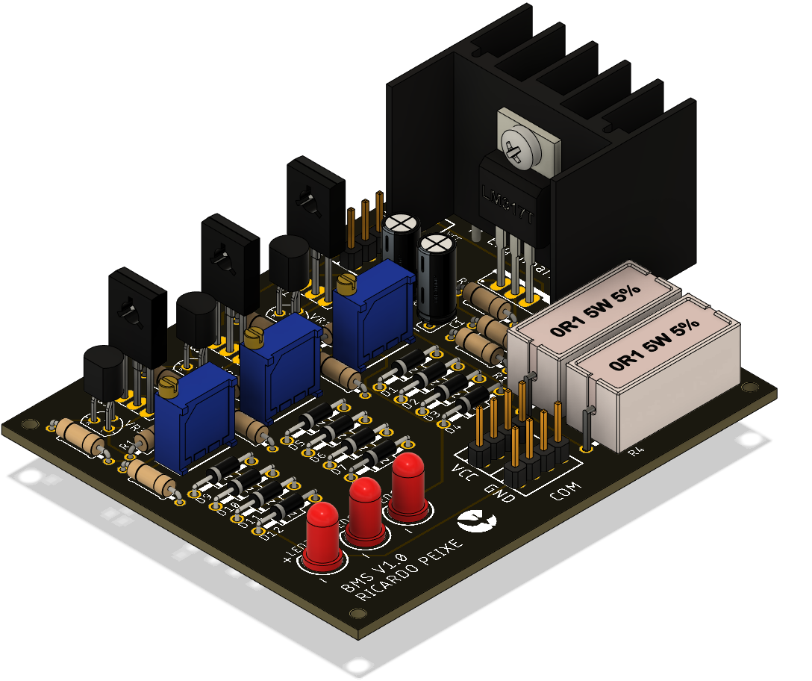

# BMS (Battery Management System)
A BMS desenvolvida terá a exclusiva tarefa de realizar o equilíbrio da bateria implementada,
através de um sistema puramente elétrico. Não existe forma de monitorizar o estado das células, nem gerir
o seu equilíbrio através de firmware, visto o objetivo desta BMS é realizar apenas um carregamento seguro
sem a interferência de meios externos. Existe a possibilidade de continuar a
desenvolver esta BMS, de um modo a trocar de uma operação local, para um sistema acessível via algum
protocolo de comunicação sem fios, o que acrescenta muitas vantagens em termos de monitorização e extração
de dados. Esta possibilidade transforma-se assim num upgrade para trabalho futuro.

